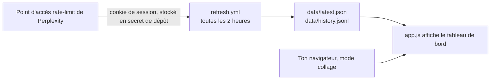

<div align="center">
  

  <h1>Perplexity Limits Dashboard</h1>

  <p><b>Vois combien de Perplexity il te reste, à quelle vitesse tu le consommes, et quand ton quota se réinitialise — depuis une seule page statique.</b></p>

  <p>
    <a href="https://wrouhli.github.io/perplexity-limits-dashboard/"></a>
  </p>

  <p>
    <a href="https://github.com/wrouhli/perplexity-limits-dashboard/actions/workflows/ci.yml"></a>
    
    
    
    
  </p>

  <p><sub><b>Français</b> · <a href="README.md">English</a></sub></p>
</div>


<p align="center"><sub>La page réelle en thème sombre, avec le jeu de données de démonstration. <a href="https://wrouhli.github.io/perplexity-limits-dashboard/">Essaie par toi-même →</a></sub></p>

---

## ✨ Ce que tu obtiens

- **Quotas globaux** — combien de requêtes Pro, Research, Labs et Agentic il te reste, avec un pourcentage par rapport au plafond de ton offre.
- **Compte à rebours** — « réinitialisation dans 6j 1h », qui défile en direct, pour savoir si tu peux dépenser ou s'il faut économiser.
- **Vitesse de consommation** — une courbe des requêtes Pro dans le temps avec une **projection en pointillés** : pas seulement où tu en es, mais à peu près quand tu tomberas à zéro.
- **Sources les plus gourmandes** — quelles sources connectées mangent réellement ton quota, classées par jour.
- **Quotas par source** — restant / utilisé / plafond pour chaque source plafonnée, la plus entamée en premier.
- **Connecteurs** — ce qui est actif, ce qui est illimité, et ce qui n'est pas dans ton offre.
- **Données brutes + export** — le JSON intact, plus un téléchargement JSON/CSV de tout l'historique.
- **Mode collage** — colle le JSON à la main, **sans identifiant et sans rien enregistrer**.
- **Installable** — ajoute-le à l'écran d'accueil de ton téléphone ; la page et le dernier instantané sont mis en cache, donc il s'ouvre hors ligne.

## 🧠 Pourquoi c'est fait comme ça

Le point d'accès de Perplexity (`/rest/rate-limit/all`) a besoin de ton cookie de session, et un navigateur ne peut pas l'appeler depuis une autre origine : `credentials: 'include'` entre origines est bloqué par CORS, et le cookie de session est `SameSite=Lax`, donc il ne serait de toute façon pas envoyé. La solution habituelle est un proxy — qui a besoin d'un serveur.

Ce projet contourne tout ça. Les chiffres sont écrits dans un **fichier JSON statique de ce dépôt**, et la page lit un chemin relatif. Même origine : pas de CORS, pas de proxy, pas de cookie dans le navigateur.



## 🚀 Utilisation — 30 secondes, rien à installer

1. [La page en ligne](https://wrouhli.github.io/perplexity-limits-dashboard/) affiche déjà le jeu de données de démonstration.
2. Pour voir **tes** chiffres sans aucune configuration : ouvre `perplexity.ai/rest/rate-limit/all` en étant connecté, sélectionne tout, copie.
3. Reviens sur la page, clique sur **Paste data**, et colle. C'est tout.

Le mode collage n'écrit jamais rien, nulle part. Tu peux aussi le forcer avec `?paste=1`.

## 🔄 Garder les chiffres à jour automatiquement

Tu veux que la page soit à jour sans rien coller ? Laisse une Action planifiée le faire pour toi.

1. Ouvre `https://www.perplexity.ai/rest/rate-limit/all` en étant connecté pour vérifier que ça se charge.
2. Copie ton cookie : DevTools → **Network** → recharge → clique sur `rate-limit/all` → **Request Headers** → copie toute la valeur de `cookie:`. (Une simple valeur `__Secure-next-auth.session-token` fonctionne aussi.)
3. Dépôt → **Settings → Secrets and variables → Actions → New repository secret** → nomme-le `PERPLEXITY_COOKIE` → colle → enregistre.
4. Lance une fois le workflow **refresh data** (Actions → refresh data → Run workflow).

Ensuite il tourne toutes les deux heures à :17, ne commit que si quelque chose a changé, et redéploie.

| | |
| --- | --- |
| **C'est un identifiant.** | Le cookie est le même jeton que celui de ton navigateur connecté. Un secret qui fuit, c'est un compte compromis. Il ne vit que dans les secrets GitHub, le script ne l'affiche jamais, et il n'écrit volontairement aucun chiffre dans les logs — parce que les logs d'un dépôt public sont publics. |
| **Il expire.** | Les jetons de session durent des semaines, pas éternellement. Quand le workflow commence à échouer, colle-en un nouveau. Toute autre solution demande un serveur. |
| **Cloudflare peut le bloquer.** | Perplexity est derrière une protection anti-bot, et une IP de datacenter peut recevoir un 403. Si ça arrive, ajoute le cookie `cf_clearance` à la même valeur secrète. |
| **Un échec ne vide jamais la page.** | En cas d'erreur, le script n'écrit rien et sort en erreur, donc la page garde le dernier instantané valide et affiche une bannière « données anciennes » au bout de six heures. |
| **GitHub s'endort.** | Les workflows planifiés sont désactivés après ~60 jours sans activité du dépôt ; n'importe quel commit les réveille. Le cron est aussi « au mieux » et peut être en retard. |

## 🔒 Vie privée

**Publier, c'est public.** Tout ce qui est commité dans un dépôt public, et tout ce que sert GitHub Pages, est lisible par n'importe qui — y compris ton historique d'usage. Si tu préfères garder les chiffres pour toi, utilise le mode collage et n'ajoute jamais le secret. Ce n'est pas une dégradation : c'est exactement à ça que sert cette porte de sortie.

En mode collage, rien ne quitte ton navigateur : le JSON est lu en mémoire et oublié au rechargement. La page n'a ni analytics, ni police distante autre qu'une feuille de style, et aucun appel tiers hormis le CDN de la bibliothèque de graphiques.

## 🧪 Tests

```bash
python3 -m unittest discover -s tests -t tests   # récupération, câblage, fichiers de données
node tests/pure.test.mjs                         # logique
node tests/render.test.mjs                       # exécute app.js dans un faux DOM
```

180 assertions, lancées à chaque push. Pas de Node ? `gjs -m tests/pure.test.mjs` et `gjs -m tests/render.test.mjs` fonctionnent aussi — les suites utilisent un petit harnais portable et sortent en erreur si un test échoue.

La suite de rendu est la plus intéressante : `tests/dom-shim.mjs` est un faux DOM minimal qui laisse le **vrai** `app.js` s'exécuter, donc un identifiant d'élément manquant ou un chemin d'affichage cassé fait échouer la CI au lieu de casser dans ton navigateur. Elle a servi : elle a attrapé une différence de variables globales entre Node et le navigateur, et une courbe qui devenait vide sur des données anciennes.

## 📁 Structure du projet

```
index.html               le balisage
styles.css               jetons de design et composants
app.js                   l'affichage ; importe lib.js
lib.js                   logique pure : lecture, classement, projection
sw.js                    cache hors ligne
manifest.webmanifest     métadonnées d'installation
data/latest.json         l'instantané courant (la copie commitée est une démo)
data/history.jsonl       une ligne JSON compacte par relevé, conservation 30 jours
scripts/fetch_limits.py  le récupérateur, bibliothèque standard uniquement
scripts/make_demo_data.py régénère la série de démonstration
tests/                   suites logique, récupérateur, câblage et rendu
.github/workflows/       tests, déploiement Pages, rafraîchissement planifié
```

`lib.js` contient tout ce qui mérite d'être testé — comment une charge utile est normalisée, à partir de quand un quota est « faible », comment un horodatage de réinitialisation est trouvé, comment une vitesse de consommation est projetée. `app.js` ne touche qu'au DOM.

## 📥 Comment les données sont lues

- Les quotas viennent de `remaining_pro`, `remaining_research`, `remaining_labs`, `remaining_agentic_research`, avec repli sur `model_specific_limits`.
- Les plafonds viennent des clés `limit_*` quand elles existent, ce qui produit le « · 32 % » sur chaque carte.
- Les sources viennent de `sources.source_to_limit`, où `monthly_limit: 0` signifie « pas dans ton offre » et `monthly_limit: null` signifie « pas de plafond ».
- **Un chiffre absent reste absent.** Il s'affiche `—` et jamais comme un `0` sûr de lui ou un « épuisé ». Un tableau de bord qui invente un zéro est pire qu'un tableau de bord qui admet qu'il ne sait pas.
- L'horodatage de réinitialisation est trouvé en cherchant des clés plausibles plutôt qu'en codant un nom de champ en dur, donc un changement de schéma se dégrade au lieu de casser.

## ❓ FAQ

**Est-ce que ça envoie mes données quelque part ?**
Non. La page lit deux fichiers posés à côté d'elle. En mode collage, elle ne fait même pas ça.

**Est-ce raisonnable de mettre mon cookie Perplexity dans GitHub ?**
C'est aussi sûr que n'importe quel secret dans GitHub Secrets : correct si ton compte est bien protégé, à réfléchir avant de faire confiance. Le script est assez court pour être audité en une minute, et il n'écrit ni le cookie ni tes chiffres dans les logs. Si tu préfères éviter, saute cette étape — le mode collage ne demande aucun identifiant.

**Est-ce que ça cassera quand Perplexity changera quelque chose ?**
Probablement, un jour. C'est pour ça que la page garde le dernier instantané avec une bannière « données anciennes », que les champs manquants s'affichent `—` au lieu de zéro, et que le récupérateur échoue bruyamment plutôt que d'écrire un fichier cassé.

**Faut-il une offre payante ?**
Pour avoir de vrais chiffres, oui. La page, elle, fonctionne de toute façon, sur les données de démonstration incluses.

**Peut-il suivre autre chose que Perplexity ?**
Le normalisateur est tolérant, pas générique. `lib.js` est l'endroit où lui apprendre une autre forme, et les tests celui où le prouver.

**Pourquoi un script depuis un CDN ?**
Chart.js, pour éviter une étape de build. S'il ne se charge pas, les chiffres s'affichent quand même et la section du graphique explique pourquoi.

**Pourquoi la courbe affiche-t-elle parfois plus que la fenêtre choisie ?**
Si une fenêtre ne laissait rien à dessiner — données de démo anciennes, ou retour après une longue pause — elle retombe sur toute la série au lieu d'afficher un cadre vide.

## 🤝 Contribuer

Les issues et les pull requests sont bienvenus. Si tu tombes sur une forme de réponse mal lue, une issue avec le JSON (caviardé) est le correctif le plus rapide possible.

Si ça t'a évité de vérifier ton quota à la main, une ⭐ aide d'autres personnes à le trouver.

## 📄 Auteur

Conçu et développé par **[Wahid Rouhli](https://www.wahidrouhli.com)** pour [Konnectoos](https://konnectoos.com). Sous licence MIT — voir [`LICENSE`](LICENSE).

> Sans affiliation avec Perplexity AI, ni approuvé par eux. Il lit un point d'accès que ton propre navigateur connecté utilise, pour ton propre compte.
