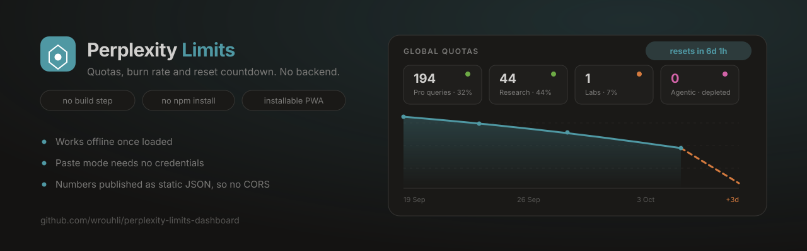
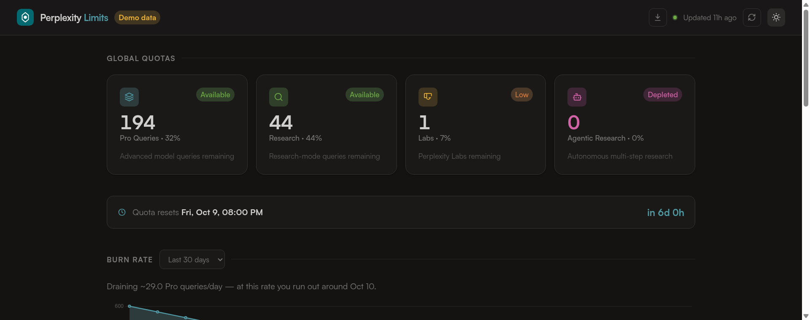
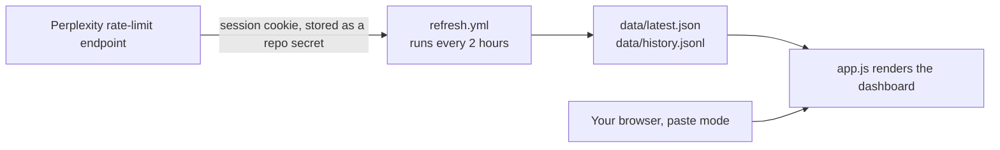

<div align="center">
  

  <h1>Perplexity Limits Dashboard</h1>

  <p><b>See how much Perplexity you have left, how fast you are burning through it, and when it resets — from one static page.</b></p>

  <p>
    <a href="https://wrouhli.github.io/perplexity-limits-dashboard/"></a>
  </p>

  <p>
    <a href="https://github.com/wrouhli/perplexity-limits-dashboard/actions/workflows/ci.yml"></a>
    
    
    
    
  </p>
</div>



<p align="center"><sub>The live page in dark theme, showing the included demo dataset. <a href="https://wrouhli.github.io/perplexity-limits-dashboard/">Try it yourself →</a></sub></p>

---

## ✨ What you get

- **Global quotas** — how many Pro, Research, Labs and Agentic queries remain, with a percentage against your plan's cap.
- **Reset countdown** — "resets in 6d 1h", ticking live, so you know whether to spend or save.
- **Burn rate** — a line chart of Pro queries over time with a **dashed projection**: not just where you are, but roughly when you run out.
- **Fastest drains** — which connected data sources are actually eating your quota, ranked per day.
- **Per-source quotas** — remaining / used / cap for every capped source, most-drained first.
- **Connectors** — what is active, what is unlimited, and what is not in your plan.
- **Raw data + export** — the untouched JSON, plus JSON/CSV download of the whole history.
- **Paste mode** — drop in the JSON by hand, with **no credential and no storage**.
- **Installable** — add it to your phone's home screen; the shell and the last snapshot are cached, so it opens offline.

## 🧠 Why it works this way

Perplexity's own endpoint (`/rest/rate-limit/all`) needs your session cookie, and a browser cannot call it from another origin: `credentials: 'include'` across origins is blocked by CORS, and the session cookie is `SameSite=Lax` so it would not be attached anyway. The usual fix is a proxy — which needs a server.

This project dodges all of it. The numbers are written to a **static JSON file in this repo**, and the page reads a relative path. Same origin, so no CORS, no proxy, no cookie in the browser.



## 🚀 Use it — 30 seconds, nothing to install

1. Opening [the live page](https://wrouhli.github.io/perplexity-limits-dashboard/) already shows the demo dataset.
2. To see **your** numbers with no setup at all: open `perplexity.ai/rest/rate-limit/all` while logged in, select all, copy.
3. Come back to the page, click **Paste data**, and paste. Done.

Paste mode never writes anything anywhere. You can also force it with `?paste=1`.

## 🔄 Keep it live automatically

Want the page current without pasting? Let a scheduled Action fetch it for you.

1. Open `https://www.perplexity.ai/rest/rate-limit/all` while logged in to confirm it loads.
2. Copy your cookie: DevTools → **Network** → reload → click `rate-limit/all` → **Request Headers** → copy the whole `cookie:` value. (A bare `__Secure-next-auth.session-token` value works too.)
3. Repo → **Settings → Secrets and variables → Actions → New repository secret** → name it `PERPLEXITY_COOKIE` → paste → save.
4. Run the **refresh data** workflow once (Actions → refresh data → Run workflow).

From then on it runs every two hours at :17, commits only when something changed, and redeploys.

| | |
| --- | --- |
| **It is a credential.** | The cookie is the same token your logged-in browser uses. Treat a leaked secret as a compromised account. It lives only in GitHub Secrets, the script never prints it, and it deliberately never logs quota numbers either — because logs on a public repo are public. |
| **It expires.** | Session tokens last weeks, not forever. When the workflow starts failing, paste a fresh one. Any alternative to that needs a server. |
| **Cloudflare may block it.** | Perplexity is behind bot protection, and a datacenter IP can get a 403. If that happens, append the `cf_clearance` cookie to the same secret. |
| **A failure never empties the page.** | On error the script writes nothing and exits non-zero, so the page keeps the last good snapshot and shows a staleness banner after six hours. |
| **GitHub sleeps.** | Scheduled workflows are disabled after ~60 days without repository activity; any commit wakes it. Cron is also best-effort and can run late. |

## 🔒 Privacy

**Publishing is public.** Anything committed to a public repo, and anything served by GitHub Pages, is readable by anyone — including your usage history. If you would rather keep the numbers to yourself, use paste mode and never add the secret. That is not a downgrade; it is what the fallback exists for.

With paste mode, nothing leaves your browser: the JSON is parsed in memory and forgotten on reload. The page has no analytics, no fonts beyond a stylesheet, and no third-party calls except the chart library's CDN.

## 🧪 Tests

```bash
python3 -m unittest discover -s tests -t tests   # fetcher, page wiring, data files
node tests/pure.test.mjs                         # logic
node tests/render.test.mjs                       # renders app.js in a DOM shim
```

180 assertions, run on every push. No Node? `gjs -m tests/pure.test.mjs` and `gjs -m tests/render.test.mjs` work too — the suites use a tiny portable harness and exit non-zero on failure.

The render suite is the interesting one: `tests/dom-shim.mjs` is a minimal fake DOM that lets the **real** `app.js` execute, so a missing element id or a broken render path fails CI instead of failing in your browser. It earned its keep — it caught a Node-vs-browser global difference and a chart that went blank on aged data.

## 📁 Project layout

```
index.html               markup
styles.css               design tokens and components
app.js                   rendering; imports lib.js
lib.js                   pure logic: parsing, classification, projection
sw.js                    offline cache
manifest.webmanifest     installable metadata
data/latest.json         current snapshot (the committed copy is demo data)
data/history.jsonl       one compact JSON row per fetch, 30-day retention
scripts/fetch_limits.py  the fetcher, standard library only
scripts/make_demo_data.py regenerates the committed demo series
tests/                   logic, fetcher, wiring and render suites
.github/workflows/       tests, Pages deploy, scheduled refresh
```

`lib.js` holds everything worth testing — how a payload is normalised, when a quota counts as "Low", how a reset timestamp is discovered, how a burn rate is projected. `app.js` only touches the DOM.

## 📥 How it reads the payload

- Quotas come from `remaining_pro`, `remaining_research`, `remaining_labs`, `remaining_agentic_research`, falling back to `model_specific_limits`.
- Caps come from `limit_*` keys when present, which is what produces the "· 32%" on each card.
- Sources come from `sources.source_to_limit`, where `monthly_limit: 0` means "not in your plan" and `monthly_limit: null` means "no cap".
- **A missing number stays missing.** It renders as `—` and never as a confident `0` or "Depleted". A dashboard that invents a zero is worse than one that admits it does not know.
- The reset timestamp is found by scanning for reset-ish keys rather than hardcoding one field name, so a schema change degrades instead of breaking.

## ❓ FAQ

**Does this send my data anywhere?**
No. The page reads two files that sit next to it. In paste mode it does not even do that.

**Is putting my Perplexity cookie in GitHub safe?**
It is as safe as any secret in GitHub Secrets: fine if your account is secure, worth thinking about before you trust it. The script is short enough to audit in a minute, and it never logs the cookie or your numbers. If you would rather not, skip it — paste mode needs no credential at all.

**Will it break when Perplexity changes something?**
Probably, eventually. That is why the page keeps the last snapshot with a staleness banner, why missing fields render as `—` instead of zero, and why the fetch job fails loudly rather than writing a broken file.

**Do I need a paid plan?**
To have real numbers, yes. The page itself runs regardless, on the included demo data.

**Can it track something other than Perplexity?**
The normaliser is tolerant, not generic. `lib.js` is where you would teach it another shape, and the tests are where you would prove it.

**Why is there a script from a CDN?**
Chart.js, to avoid a build step. If it fails to load, the numbers still render and the chart section says why.

**Why does the chart sometimes show more than my selected window?**
If a window would leave nothing to draw — an aged demo dataset, or coming back after a long gap — it falls back to the whole series rather than showing an empty box.

## 🤝 Contributing

Issues and pull requests are welcome. If you find a payload shape this misreads, an issue with the JSON (redacted) is the fastest possible fix.

If this saved you from checking your quota by hand, a ⭐ helps other people find it.

## 📄 Author

Built and designed by **[Wahid Rouhli](https://www.wahidrouhli.com)** for [Konnectoos](https://konnectoos.com). MIT licensed — see [`LICENSE`](LICENSE).

> Not affiliated with or endorsed by Perplexity AI. It reads an endpoint your own logged-in browser uses, for your own account.
